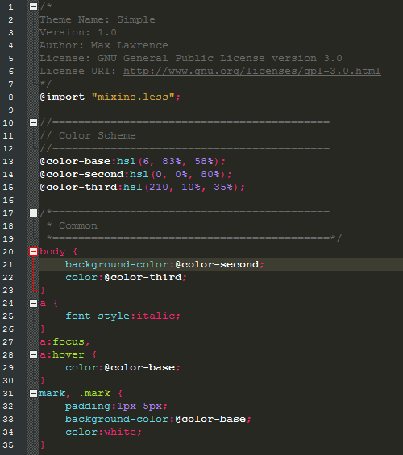

# LESS Syntax Highlighting for Notepad++

* [About](#about)
* [Use](#how-to-use)
* [Screenshot](#screenshot)
* [License](#license)

### ABOUT

Syntax highlighting for LESS files in Notepad++ (UDL v2.1).

Features:
* Monokai Theme
* Code Folding

### HOW TO USE

 - Download the `less.xml` file
 - Open Notepad++
 - Go to  `Language -> Define your language...`,  click on  `Import...` and select the `less.xml` file you've downloaded
 - Close and Restart Notepad++

### SCREENSHOT

### LICENSE

Released under the [MIT License](http://www.opensource.org/licenses/mit-license.php)

* * *

Copyright :copyright: 2015 Max Lawrence